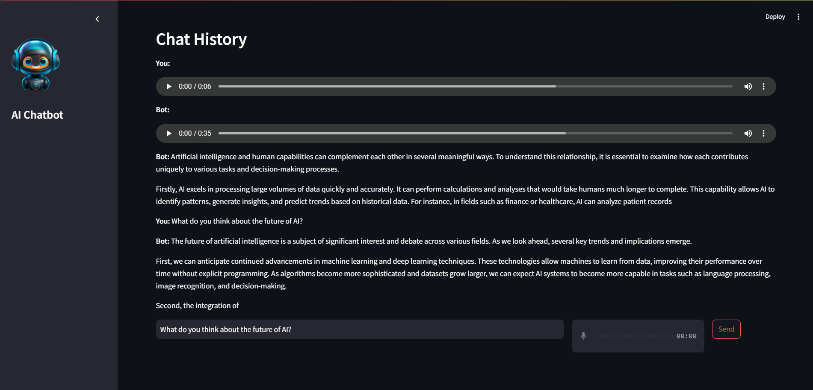

# **Voice Bot using Azure OpenAI(ChatGPT)**  

## **Overview**  
This project is a voice-enabled chatbot built using **Azure OpenAI**, **Whisper OpenAI**, and **pyttsx3** for voice interactions. The chatbot can listen to user queries, process them using OpenAI’s LLM, and respond with synthesized speech. It features a **Streamlit** frontend for a user-friendly interface.  

## **Features**  
- **Speech-to-Text**: Uses OpenAI’s Whisper model to transcribe user speech.  
- **LLM Response**: Processes user queries using Azure OpenAI’s GPT model.  
- **Text-to-Speech**: Converts the chatbot’s responses to speech using `pyttsx3`.  
- **Web Interface**: A simple and interactive **Streamlit** UI.  

## **Steamlit website image**


## **Prerequisites**  
Before running the project locally, ensure you have:  
1. **Azure OpenAI API credentials** (for GPT model)  
2. **Hugging Face API key** (if used for additional processing)  
3. **Python (>= 3.8)** installed on your system  

## **Installation & Setup**  

### **Step 1: Clone the Repository**  
```bash
git clone <repository_url>
cd <repository_directory>
```

### **Step 2: Install Dependencies**  
Ensure you have Python installed, then run:  
```bash
pip install -r requirements.txt
```

### **Step 3: Set Up API Keys**  
Create a `.env` file in the project root and add the following:  
```env
AZURE_OPENAI_API_KEY = your_azure_api_key
HUGGINGFACE_API_KEY = your_huggingface_api_key
AZURE_OPENAI_ENDPOINT = your_azure_endpoint
AZURE_OPENAI_DEPLOYMENT_NAME = your_azure_deployment_name
AZURE_OPENAI_API_VERSION = your_azure_api_version
```

### **Step 4: Run the Application**  
Launch the Streamlit app using:  
```bash
streamlit run streamlit_app.py
```

## **Usage**  
- Speak into the microphone when prompted.  
- The bot will process your input and respond with both text and voice output.  
- Use the UI controls for additional settings (if available).  

## **Architecture & Design Decisions**  
- **Azure OpenAI** was chosen for its enterprise-grade LLM capabilities.  
- **Whisper OpenAI** ensures high-quality speech-to-text conversion.  
- **pyttsx3** and **gtts** was used for offline text-to-speech synthesis.  As for this project I proceeded witht the "gtts"
- **Streamlit** simplifies deployment with a clean UI and minimal setup. 